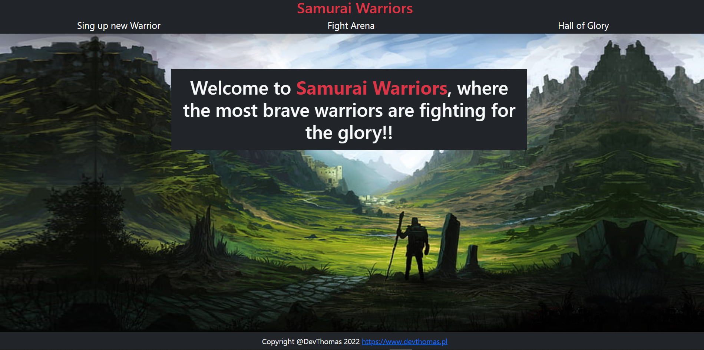

# 🐱‍👤 TypeScript-Warrior 🐱‍🏍🤖

## It's excercise which have a goal to train refactoring from JavaScript to TypeScript. Excercise from previous modules of MEGA-K course with continous improvement.




### TypeScript Warrior v1:

ToDo:
V1:
- [x] Webstorm configuration
- [x] Installation packages and configuration TypeScript  
- [x] Express configuration and public folder - static files creation
- [x] Routes structure:
  - Main page - /
  - Warrior sing
    - form 
    - save warrior
  - Fight Arena
    - form - choose warrior
    - fight - log from the actual fight
  - Hall of Glory
    - List of 10 best Warriors 
- [x] View - Overall views structure
- [x] Warrior Record
  - Database name: typescript_warrior_db
  - Tables:
    - warrior: 
      - ID- UUID (VARCHAR(36))
      - name - varchar - unique
      - Strength - TINYINT(2)
      - Defence - TINYINT(2)
      - Wytrzymałość - TINYINT(2)
      - Obrona - TINYINT(2)
      - Wins - INT(11) - default 0
- [x] Logic for Warriors creation 
- [x] Logic for Hall of Glory
- [x] Logic for Fight Arena

V2:
- [ ] Visualization for Fight Log
- [ ] Front-End JavaScript to handle points for warriors


Algorithm:

1. Every warrior on the beginning have health (HP) calculated as stamina * 10.
2. Every warrior on the beginning have defence (DP) same as number of defence points.
3. The warrior who is starting is attaching with the value same as strength points
4. If attacked warrior have defence  + agility  bigger than attacker strength:
   4.1. Defence is decreased by strength points
   4.2.A) If attack was higher than defence, then health is decreased by remaining amount of strength decreased by 
   defence of opponent.
   4.2.B) If attack was the same or smaller than defence, then health points remains the same.
   4.2. Jeżeli warunek 3 NIE JEST SPEŁNIONY to po prostu od życia odejmujemy atak
5. Change roles, and the attacker is now in defence role and defender in attacker role.
6. Repeat whole algorithm until health of one warrior is <= 0, then the winner is the one with remaining health


package.json:  
```
{
  "name": "typescript-warrior",
  "version": "1.0.0",
  "description": "",
  "main": "index.js",
  "scripts": {
    "start": "ts-node index.ts",
    "start:dev": "tsnd index.ts"
  },
  "keywords": [],
  "author": "",
  "license": "ISC",
  "dependencies": {
    "express": "^4.17.2",
    "express-async-errors": "^3.1.1",
    "express-handlebars": "^6.0.2",
    "method-override": "^3.0.0",
    "mysql2": "^2.3.3",
    "uuid": "^8.3.2"
  },
  "devDependencies": {
    "@types/express": "^4.17.13",
    "@types/node": "^17.0.16",
    "@types/method-override": "^0.0.32",
    "@types/uuid": "^8.3.4",
    "ts-node": "^10.4.0",
    "ts-node-dev": "^1.1.8",
    "typescript": "^4.5.5"
  }
}

```

tsconfig.json
```  
{
  "compilerOptions": {
    "noImplicitAny": true,
    "preserveConstEnums": true,
    "sourceMap": true,
    "target": "es6",
    "downlevelIteration": true,
    "lib": [
      "es6",
      "dom.iterable"
    ],
    "outDir": "dist",
    "experimentalDecorators": true,
    "emitDecoratorMetadata": true,
    "moduleResolution": "Node"
  }
}

```
